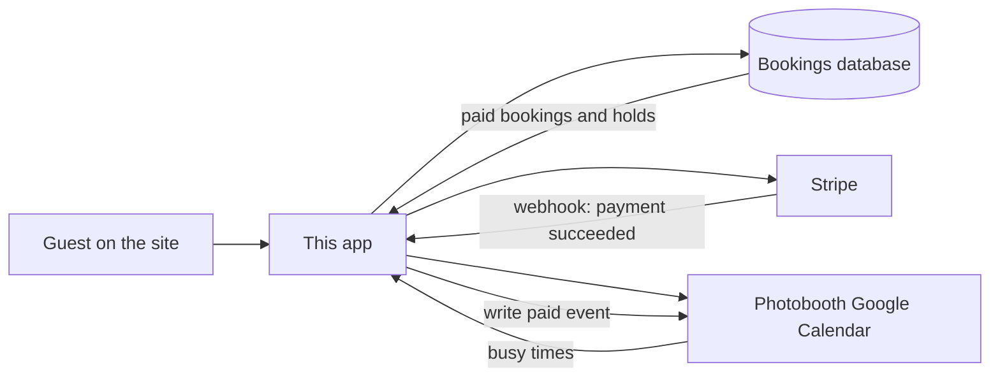

# Studio 7 Miami — Photobooth Booking

This is the public booking site for photobooth rentals. A guest can pick a package, choose a time that is actually free, sign the service agreement, and pay — without a back-and-forth over text or email to hold the date.

**Live:** [book.studio7.miami/photobooth](https://book.studio7.miami/photobooth)

---

## Who this is for

**Organization:** Studio 7 Miami  
**Founder:** Seven  
**Built by:** [TAĪSTU](https://taistu.com)

## What a guest does

Five steps, in order. They cannot skip ahead, and payment stays locked until the agreement is signed.

1. **Choose an experience** — The Miami Classic, Social, or Luxe.
2. **Pick date, start time, and duration** — Only open times are offered. Extra hours update the price as they go. Luxe can add stations.
3. **Event details** — Name, email, phone, event type, and location (Studio 7 Miami is offered as a venue; other Florida addresses autocomplete).
4. **Review & sign** — The agreement is filled in with their event, price, deposit, and balance due date. They sign on the page. That starts a **10-minute hold** on the slot.
5. **Pay** — Deposit (50%) or pay in full. Events **3 days away or closer must be paid in full**. Cards are not saved. When Stripe confirms, the date is booked.

If they leave mid-flow, the browser keeps a draft for **ten minutes**. After ten minutes of inactivity the flow starts over and any unpaid hold on that time is released. After signing, they also have ten minutes to finish payment. If that hold expires, the time opens again and they start over to reserve it.

On success they see a confirmation: package, date and time, location, their contact details, and what they paid. A deposit booking also shows the remaining balance and the date it is due.

---

## Packages and money

| Package | Who it is for | Included time | Price |
| --- | --- | --- | --- |
| **The Miami Classic** | Up to 50 guests | 2 hours | $250 |
| **The Miami Social** | 51–200 guests | 3 hours | $500 |
| **The Miami Luxe** | 200+ guests | 5 hours per station | $1,500 per station |

Extra hours: Classic $100/hr, Social $150/hr, Luxe $200/hr per station.

- Deposit is **50% of the total**. The rest is due **7 days before the event**.
- The deposit is **non-refundable** (the signed agreement says so).
- Totals are always calculated on the server from these numbers. The browser display cannot be trusted as the charge amount.

---

## How a date actually gets locked

There is **one photobooth kit**. A day can take **at most two rentals**, and only if their windows do not overlap.

Each rental occupies more than the party hours: **one hour of setup before start**, and **one hour of breakdown after**. Two Classic bookings on the same day only fit when those padded windows do not collide. Luxe takes the whole day.

Times offered are **10:00 AM – 11:30 PM Eastern**, in 30-minute steps. Guests cannot book for today — the earliest date is tomorrow.

A slot is treated as taken if **any** of these are true:

- A **paid booking** already sits on that window.
- Someone **just signed** and is still inside the 10-minute pay window.
- The photobooth **Google Calendar** already has something there (a meeting, a block, an all-day hold). Short calendar events still count as at least a **2-hour** kit hold, so a 5:00 PM meeting is treated as 5:00–7:00.

Until Stripe says the money cleared, the date is not booked. Signing alone is only a short hold.

---

## How the pieces connect

Four systems share the work. None of them is the whole picture by itself.

**This app** is the guest experience and the rules engine: packages, prices, open times, the agreement, and the pay sheet.

**The bookings database (Supabase)** is the source of truth for every rental. Each row has the guest, the event, the signed agreement (including a hash of the exact text they signed), payment amounts, and status (`draft` → `agreement_signed` → `deposit_paid` or `paid_in_full` → `confirmed`).

**Stripe** takes the card (and Apple Pay / Link when the domain is verified). After a successful charge it emails the **payment receipt**, then tells this app via webhook. The site does not mark a booking paid from the browser — only from Stripe.

**Google Calendar** (`photobooth@studio7.miami`) is how Studio 7 blocks the kit in real life. The app **reads** that calendar so existing holds and meetings keep those times off the public site. After payment it **writes** an event for the booked hours (not the extra setup/breakdown — those only exist in availability math, so they are not double-counted). Events this app creates are tagged and skipped when reading occupancy, so a paid booking is not counted twice. The guest is **not** invited to the calendar event.

Together: calendar + database decide what a new guest can pick. Stripe decides when a pick becomes a booking. The calendar then shows the founder the new job.

---

## After they pay

| What | Who sends it |
| --- | --- |
| Payment receipt | Stripe, to the email they entered |
| Confirmation on screen | This app, immediately after Stripe confirms |
| Agreement copy and event details in the inbox | The Studio 7 concierge (not this app) |
| Block on the photobooth calendar | This app, as soon as payment is confirmed |

A deposit booking is confirmed with the remaining balance shown and a due date. Collecting that remaining balance is not a button on the confirmation screen today.

---

## Day-to-day for Studio 7

You do not need an admin panel inside this site.

- **New paid jobs** appear on the photobooth Google Calendar with package, guest name, contact, and booking id.
- **Money** is in the Stripe Dashboard (Successful payments). Receipts go out from Stripe.
- **The signed agreement** lives on the booking record (who signed, when, from which IP, and a hash of the contract text).
- **To block a day or a window** that should not be bookable, put it on the photobooth calendar. The public site will treat it as occupied.
- **To change a price, included hours, deposit percent, hold length, or setup/breakdown**, that is a config change in this project — not something a guest can override.

---

## What this app does not do

- It does not email the signed agreement or a “you’re booked” letter. That follow-up is the concierge.
- It does not save cards for later charges.
- It does not invite the guest onto the Google Calendar event.
- It is not a staff dashboard. Look at Calendar + Stripe for the live picture.

---

*Book · Studio 7 Miami × TAĪSTU · August 2026*