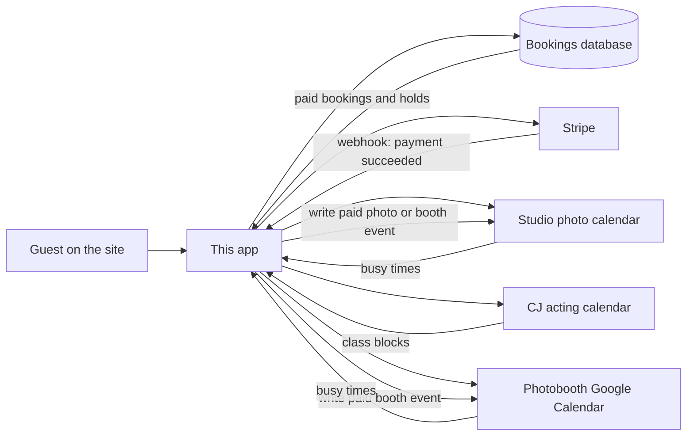

# Studio 7 Miami — Booking

Public booking for the studio and for photobooth rentals. A guest picks an offering, chooses a time that is actually free, signs the service agreement, and pays.

**Live**

- Studio sessions: [book.studio7.miami](https://book.studio7.miami/)
- Photobooth rentals: [book.studio7.miami/photobooth](https://book.studio7.miami/photobooth)

---

## Who this is for

**Organization:** Studio 7 Miami  
**Founder:** Seven  
**Built by:** [TAĪSTU](https://taistu.com)

---

## Studio sessions (`/`)

Same five-step chrome as the booth: experience → date & time → details → sign → pay. Location is always Studio 7 Miami.

1. **Choose a session** — Framehaus Media, Portraits, Beauty / Theatrical / Standard headshots, Passport Photos, or Acting Class w/ CJ.
2. **Pick date and time** — Photo sessions use open 15-minute starts, 10:00 AM – 7:00 PM Eastern, with a 15-minute buffer between bookings. Extra 30-minute time is available once a per-step rate is set in `src/config/studio/offerings.ts`. Acting class is a **group** seat in a published Saturday 2:00 PM class (capacity 8).
3. **Your details** — Name, email, phone, optional notes.
4. **Review & sign** — Studio agreement (`studio-v1`). Starts a **10-minute hold**.
5. **Pay** — Offerings **$225 and up** may take a 50% deposit (full pay if the session is within 3 days). Framehaus ($165), passport ($50), and acting class ($50) are **paid in full**. Cards are not saved.

Photo occupancy is a dedicated studio/photographer Google Calendar (`GOOGLE_CALENDAR_ID_STUDIO`). Acting class uses CJ's calendar (`GOOGLE_CALENDAR_ID_ACTING`) only as blocks — published class times live in config; paid seats live in the database. Photo and class can overlap.

| Session | Time | Price | Pay |
| --- | --- | --- | --- |
| Framehaus Media | 90 min | $165 | Full |
| Portraits | 90 min | $350 | Deposit OK |
| Beauty Headshots | 90 min | $300 | Deposit OK |
| Theatrical Headshots | 90 min | $300 | Deposit OK |
| Standard Headshots | 30 min | $225 | Deposit OK |
| Passport Photos | 15 min | $50 | Full |
| Acting Class w/ CJ | 2 hr | $50 | Full (group seat) |

After payment, photo sessions are written to the studio calendar. Acting class does **not** create one calendar event per student.

---

## Photobooth rentals (`/photobooth`)

Five steps, in order. They cannot skip ahead, and payment stays locked until the agreement is signed.

1. **Choose an experience** — The Miami Classic, Social, or Luxe.
2. **Pick date, start time, and duration** — Only open times are offered. Extra hours update the price as they go. Luxe can add stations.
3. **Event details** — Name, email, phone, event type, and location (Studio 7 Miami is offered as a venue; other Florida addresses autocomplete).
4. **Review & sign** — The agreement is filled in with their event, price, deposit, and balance due date. They sign on the page. That starts a **10-minute hold** on the slot.
5. **Pay** — Deposit (50%) or pay in full. Events **3 days away or closer must be paid in full**. Cards are not saved. When Stripe confirms, the date is booked.

If they leave mid-flow, the browser keeps a draft for **ten minutes**. After ten minutes of inactivity the flow starts over and any unpaid hold on that time is released. After signing, they also have ten minutes to finish payment. If that hold expires, the time opens again and they start over to reserve it.

On success they see a confirmation: package, date and time, location, their contact details, and what they paid. A deposit booking also shows the remaining balance and the date it is due.

### Packages and money

| Package | Who it is for | Included time | Price |
| --- | --- | --- | --- |
| **The Miami Classic** | Up to 50 guests | 2 hours | $250 |
| **The Miami Social** | 51–200 guests | 3 hours | $500 |
| **The Miami Luxe** | 200+ guests | 5 hours per station | $1,500 per station |

Extra hours: Classic $100/hr, Social $150/hr, Luxe $200/hr per station.

- Deposit is **50% of the total**. The rest is due **7 days before the event**.
- The deposit is **non-refundable** (the signed agreement says so).
- Totals are always calculated on the server from these numbers. The browser display cannot be trusted as the charge amount.

### How a date actually gets locked

There is **one photobooth kit**. A day can take **at most two rentals**, and only if their windows do not overlap.

Each rental occupies more than the party hours: **one hour of setup before start**, and **one hour of breakdown after**. Two Classic bookings on the same day only fit when those padded windows do not collide. Luxe takes the whole day.

Times offered are **10:00 AM – 11:30 PM Eastern**, in 30-minute steps. Guests cannot book for today — the earliest date is tomorrow.

A slot is treated as taken if **any** of these are true:

- A **paid photobooth booking** already sits on that window.
- Someone **just signed** and is still inside the 10-minute pay window.
- The photobooth **Google Calendar** already has something there (a meeting, a block, an all-day hold). Short calendar events still count as at least a **2-hour** kit hold, so a 5:00 PM meeting is treated as 5:00–7:00.

Until Stripe says the money cleared, the date is not booked. Signing alone is only a short hold.

---

## How the pieces connect

Four systems share the work. None of them is the whole picture by itself.

**This app** is the guest experience and the rules engine: packages, prices, open times, the agreement, and the pay sheet. Studio lives at `/`; photobooth at `/photobooth`.

**The bookings database (Supabase)** is the source of truth. Each row has `product` (`studio` or `photobooth`) and `resource` (`studio_photo`, `studio_acting`, or `photobooth_kit`), the guest, the signed agreement (including a hash of the exact text they signed), payment amounts, and status (`draft` → `agreement_signed` → `deposit_paid` or `paid_in_full` → `confirmed`).

**Stripe** takes the card (and Apple Pay / Link when the domain is verified). After a successful charge it emails the **payment receipt**, then tells this app via webhook. Preferred URL: `https://book.studio7.miami/api/public/payments/webhook?env=live`. The old `/photobooth/api/public/payments/webhook` path is kept as an alias.

**Google Calendar**

- Photobooth kit: `GOOGLE_CALENDAR_ID` (existing).
- Studio photo: `GOOGLE_CALENDAR_ID_STUDIO`.
- Acting class blocks: `GOOGLE_CALENDAR_ID_ACTING`.

The guest is **not** invited to calendar events.

---

## After they pay

| What | Who sends it |
| --- | --- |
| Payment receipt | Stripe, to the email they entered |
| Confirmation on screen | This app, immediately after Stripe confirms |
| Agreement copy and event details in the inbox | The Studio 7 concierge (not this app) |
| Block on the matching calendar | This app, as soon as payment is confirmed (photo and photobooth only) |

A deposit booking is confirmed with the remaining balance shown and a due date. Collecting that remaining balance is not a button on the confirmation screen today.

---

## Day-to-day for Studio 7

You do not need an admin panel inside this site.

- **New paid photo sessions** appear on the studio photo Google Calendar.
- **New paid photobooth jobs** appear on the photobooth Google Calendar.
- **Acting class seats** live on the booking record (capacity is counted in the app). Block a week on CJ's calendar to hide that class.
- **Money** is in the Stripe Dashboard (Successful payments). Receipts go out from Stripe.
- **The signed agreement** lives on the booking record.
- **To block a photo window**, put it on the studio photo calendar. **To block the booth**, put it on the photobooth calendar.
- **To change a price, hours, deposit rules, hold length, class schedule, or buffer**, that is a config change in this project.

Apply the latest Supabase migration so `product`, `resource`, `duration_minutes`, `class_session_id`, and `client_notes` exist on `bookings`.

---

## What this app does not do

- It does not email the signed agreement or a “you’re booked” letter. That follow-up is the concierge.
- It does not save cards for later charges.
- It does not invite the guest onto the Google Calendar event.
- It is not a staff dashboard. Look at Calendar + Stripe for the live picture.

---

*Book · Studio 7 Miami × TAĪSTU · August 2026*
